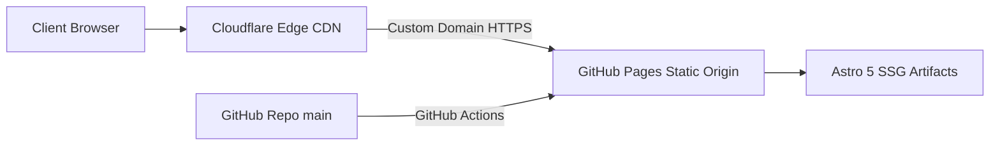

# Deployment Guide — GitHub Pages & Cloudflare

This document details the production deployment pipeline for the **Burhani Enterprise Website**, which pairs **GitHub Pages** as the static hosting origin with **Cloudflare** for DNS management, edge caching, and SSL/TLS termination.

---

## 1. Architecture Overview



- **Static Generation:** Astro 5 compiles all routes to optimized static HTML, CSS, and JS (`output: 'static'`).
- **Origin Server:** GitHub Pages serves the `dist/` directory directly.
- **Edge Layer:** Cloudflare handles custom domain routing, SSL/TLS certificates, DDoS mitigation, and global edge caching.

---

## 2. GitHub Pages Setup

### Repository Settings
1. Navigate to repository **Settings** &rarr; **Pages**.
2. Under **Build and deployment**:
   - **Source:** Choose **GitHub Actions**.

### GitHub Actions Workflow
Create `.github/workflows/deploy.yml` with the following definition:

```yaml
name: Deploy Burhani Enterprise to GitHub Pages

on:
  push:
    branches: [ main ]
  workflow_dispatch:

permissions:
  contents: read
  pages: write
  id-token: write

concurrency:
  group: "pages"
  cancel-in-progress: false

jobs:
  build:
    name: Build Static Site
    runs-on: ubuntu-latest
    steps:
      - name: Checkout Repository
        uses: actions/checkout@v4

      - name: Setup Node.js
        uses: actions/setup-node@v4
        with:
          node-version: 22
          cache: npm

      - name: Install Dependencies
        run: npm ci

      - name: Typecheck & Lint
        run: |
          npm run astro check
          npm run lint

      - name: Build with Astro
        run: npm run build

      - name: Upload GitHub Pages Artifact
        uses: actions/upload-pages-artifact@v3
        with:
          path: ./dist

  deploy:
    name: Deploy to GitHub Pages
    needs: build
    runs-on: ubuntu-latest
    environment:
      name: github-pages
      url: ${{ steps.deployment.outputs.page_url }}
    steps:
      - name: Deploy to GitHub Pages
        id: deployment
        uses: actions/deploy-pages@v4
```

---

## 3. Cloudflare Custom Domain Configuration

### DNS Records
In your Cloudflare Dashboard for `burhanienterprise.com`:

| Type | Name | Target | Proxy Status |
|---|---|---|---|
| **CNAME** | `@` (root) | `sebyy786.github.io` | **Proxied** (Orange Cloud) |
| **CNAME** | `www` | `sebyy786.github.io` | **Proxied** (Orange Cloud) |

### SSL/TLS Encryption
1. Navigate to **SSL/TLS** &rarr; **Overview**.
2. Set encryption mode to **Full (strict)** or **Full**.
3. Under **Edge Certificates**:
   - Enable **Always Use HTTPS**.
   - Set **Minimum TLS Version** to `1.2`.
   - Enable **Automatic HTTPS Rewrites**.

### Custom Domain File in Repository
Astro copies all files in `public/` directly into the build output root.
To bind GitHub Pages to your custom domain:
- Place a `CNAME` file inside `public/CNAME` with:
  ```text
  burhanienterprise.com
  ```

---

## 4. Local Build Verification

Always test production builds locally before pushing:

```powershell
# 1. Clean build
npm run build

# 2. Preview production build locally
npm run preview
```
Visit `http://localhost:4321` to verify static rendering.
